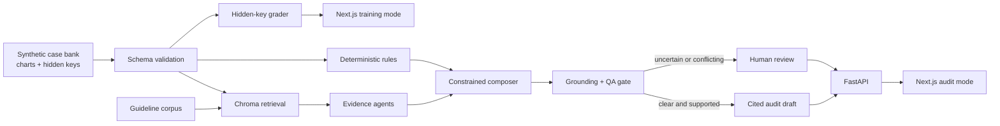

# ChartProof

### Evidence-grounded clinical chart validation with human review

[**Live application**](https://chartproof.vercel.app) ·
[**Live API**](https://chartproof-api.vercel.app) ·
[**CI status**](https://github.com/pavanbobba09/chartproof/actions/workflows/ci.yml) ·
[**Evaluation report**](evals/out/results.md)

ChartProof is a production-minded NLP portfolio project for inpatient clinical
validation audits. It reads a synthetic patient chart, checks whether a billed
diagnosis is supported by encoded clinical criteria, identifies line-level
evidence, drafts a cited rationale, and sends uncertain cases to a human
reviewer.

The project is intentionally narrow—sepsis only—but complete from data and
rules through evaluation, API, user experience, CI, and public deployment.

> **Synthetic portfolio demo only.** Never use real PHI. Drafts require a
> qualified human reviewer and must not be used for clinical or payment
> decisions.

## Start here: two-minute demo

Open [chartproof.vercel.app](https://chartproof.vercel.app), then:

1. Review the case bank totals, search, filters, and pagination.
2. Open the audit for `sepsis_001`.
3. Select evidence to jump to the exact cited chart line.
4. Review the criteria checklist, determination, confidence, and rationale
   letter.
5. Return to the case bank and open training mode.
6. Choose a verdict, select chart lines with the mouse or keyboard, and submit
   for evidence-level feedback.

The public free-tier API serves immutable, CI-verified audit drafts. The full
fresh retrieval and composition pipeline runs locally and in CI; this boundary
is deliberate and documented rather than hidden behind the demo.

## The problem

Hospitals submit ICD-10 diagnoses that influence DRG reimbursement. Clinical
validation auditors must determine whether the chart supports each billed
diagnosis and provide defensible evidence for their conclusion.

That work is difficult because:

- evidence is scattered across notes, labs, and vital-sign timelines;
- a diagnosis label is not proof that the diagnosis is clinically supported;
- conclusions must survive clinical and coding review;
- ambiguous charts should be deferred, not forced into a confident answer;
- training new auditors requires feedback on both the verdict and the evidence.

## The solution

ChartProof combines deterministic rules with retrieval and constrained NLP:

- rules calculate structured clinical criteria;
- evidence agents locate narrative and structured support;
- every evidence item points to an exact document and line range;
- the composer may only reference registered evidence IDs;
- a grounding gate verifies that citations actually support their assigned
  side and claim;
- disagreements, missing evidence, or low confidence produce `needs_review`;
- the user interface keeps the reviewer in control of the final decision.

The LLM is an optional drafting component—not the source of clinical truth.
Deterministic rules, citation enforcement, evaluation, and human review form
the trust boundary.

## End-to-end workflow

1. **Case ingestion** — Pydantic validates the synthetic chart, documents,
   structured observations, and dataset provenance.
2. **Retrieval** — ChromaDB retrieves relevant chart and guideline passages.
3. **Evidence extraction** — narrative agents and structured rules create
   criterion-specific `for` and `against` evidence.
4. **Rules decision** — the deterministic engine evaluates infection and organ
   dysfunction without relying on the LLM.
5. **Composition** — a deterministic composer, or optional Groq composer,
   drafts the determination and rationale using evidence IDs only.
6. **Grounding validation** — code verifies exact spans, evidence sides,
   determination support, evidence-table IDs, and guideline sections.
7. **QA and deferral** — disagreement or uncertainty becomes `needs_review`
   with reviewer-readable reasons.
8. **Audit experience** — the reviewer can inspect criteria, jump from a
   citation to its chart line, and read the drafted letter.
9. **Training experience** — a trainee submits a verdict and selected lines;
   the server grades both against a hidden answer key.
10. **Continuous verification** — unit, evaluation, build, and Chrome journey
    gates run in GitHub Actions.

## Product experience

### Case bank

- 100 synthetic records with search, difficulty filters, dataset-purpose
  filters, and pagination.
- Visible distinction between 15 independently authored clinical scenarios
  and 85 deterministic volume-test variants.
- No answer-key rationale is returned by the case-list or chart APIs.

### Audit mode

- Criteria-by-criteria `met`, `not_met`, or `unclear` status.
- Evidence table with side, criterion, excerpt, and exact chart span.
- Click-to-highlight evidence navigation.
- Determination, confidence, review reasons, and cited rationale letter.
- Explicit human deferral for ambiguous records.

### Training mode

- Supported/not-supported verdict submission.
- Mouse and keyboard selection of chart lines.
- Server-side validation of document IDs, line bounds, span size, duplicates,
  and selection count.
- Feedback on verdict accuracy, missed evidence, and extra selections.

## Architecture



### Runtime profiles

| Profile | Purpose | Behavior |
|---|---|---|
| Full backend (`backend.app`) | Local development, Docker, CI | Rules, Chroma retrieval, optional Groq composition, traces, runtime cache |
| Public API (`backend.vercel_app`) | Free personal portfolio hosting | Case access, immutable precomputed audits, guarded training grading |

Both profiles use the same cases, schemas, audit response contract, answer keys,
and training guardrails. Public audit responses identify themselves as
`source: precomputed` and return the `X-ChartProof-Mode:
precomputed-portfolio` header.

## Trust and safety engineering

The highest-risk failures in an evidence system are confident outputs with
incorrect or misleading citations. ChartProof includes explicit defenses:

- Each chart observation is assigned its own evidence side; a criterion-wide
  verdict cannot relabel every matching line.
- Creatinine rise is chronological, so a decrease cannot count as a rise.
- Earlier qualifying abnormalities are not erased by a later normal value.
- Evidence excerpts must exactly match valid chart line ranges.
- Supported sepsis determinations must cite organ-dysfunction evidence, not
  infection alone.
- Guideline source IDs and section names must exist in the manifest.
- Empty evidence cannot receive a perfect faithfulness score.
- Deliberately ambiguous cases must defer to a human.
- Internal server errors return a safe reference ID instead of paths or
  provider details.

These are regression-tested rather than enforced only through prompts.

## Evaluation results

The current full bank contains 100 synthetic records: 15 independent clinical
scenarios and 85 deterministic variants used for workflow, API, and volume
testing. The variants increase test volume; they do not claim to increase the
independent clinical evidence base.

| Metric | Full bank | CI smoke suite | Required threshold |
|---|---:|---:|---:|
| Determination accuracy | 1.000 | 1.000 | >= 0.80 |
| Evidence recall | 0.946 | 1.000 | >= 0.70 |
| Grounded citation faithfulness | 1.000 | 1.000 | >= 0.95 |
| Deferral rate | 0.060 | 0.000 | Tracked |

An additional per-case recall floor of `0.50` prevents a strong aggregate from
hiding a poorly supported individual result. The nonzero full-bank deferral
rate is intentional: ambiguous case `sepsis_011` and its volume variants route
to human review.

The faithfulness metric verifies meaning and provenance—not merely whether a
citation field is present. See the [full evaluation report](evals/out/results.md).

## Quality gates

Every pull request runs:

- Python linting;
- 96 backend and API tests;
- Next.js production build and TypeScript validation;
- live deterministic smoke evaluation against rebuilt retrieval data;
- production-mode Chrome journey covering the case bank, audit evidence, and
  training grade;
- failure on browser console or page errors.

The same Chrome journey also passes against the
[public deployment](https://chartproof.vercel.app).

## What this project demonstrates

- Turning an ambiguous NLP product idea into a narrow, testable vertical slice.
- Separating deterministic decision logic from probabilistic text generation.
- Building traceable evidence and citation contracts across backend and UI.
- Designing evaluation metrics that catch semantic grounding failures.
- Treating uncertainty and human review as product behavior, not edge cases.
- Shipping a typed API, accessible frontend, CI gates, Docker profile, and live
  free-tier deployment.
- Documenting dataset provenance and deployment tradeoffs without overstating
  clinical readiness.

## Technology

| Layer | Technology |
|---|---|
| Frontend | Next.js 14, React, TypeScript, Tailwind CSS |
| API and schemas | FastAPI, Pydantic |
| Workflow | LangGraph |
| Retrieval | ChromaDB, sentence-transformers |
| Rules | Deterministic Python criteria engine |
| Optional composition | Groq-compatible chat completion API |
| Evaluation | Pytest, custom grounding metrics, YAML thresholds |
| Browser testing | Playwright Core with system Chrome |
| Delivery | GitHub Actions, Docker, Vercel Hobby |

## Repository map

```text
backend/
  app.py                 Full FastAPI application
  vercel_app.py          Lightweight public portfolio API
  pipeline/              Retrieval, evidence, compose, QA, training
  rules/                 Deterministic criteria engine
  tests/                 Unit, contract, regression, and API tests
data/
  cases/                 100 synthetic charts
  keys/                  Hidden answer keys
  criteria/              Machine-readable sepsis criteria
  guidelines/            Reference corpus and manifest
  precomputed/           CI-verified public audit drafts
evals/                   Smoke/full suites, metrics, thresholds, reports
frontend/                Next.js audit and training interface
project_memory/          Design decisions, reviews, and phase records
scripts/                 Demo and operational checklists
app.py                   Vercel FastAPI entrypoint
Dockerfile               Full-pipeline container profile
```

## Run locally

### Requirements

- Python 3.11
- Node.js 20+
- Chrome for the browser journey
- Groq key only for synthetic generation or the opt-in LLM composer

### Backend

```bash
git clone https://github.com/pavanbobba09/chartproof.git
cd chartproof

python3.11 -m venv .venv
source .venv/bin/activate
pip install -r backend/requirements.txt -r backend/requirements-dev.txt
cp .env.example .env

# Required only for fresh retrieval-backed audits.
python -m backend.index.build --data data --out .chroma

uvicorn backend.app:app --reload --port 8000
```

### Frontend

In a second terminal:

```bash
cd chartproof/frontend
cp .env.example .env.local
npm ci
npm run dev
```

Open `http://localhost:3000`.

### Verify the project

```bash
source .venv/bin/activate
ruff check backend data evals app.py
pytest backend/tests -q
python -m evals.run --suite smoke --live --enforce-thresholds

cd frontend
npm run lint
npm run build
npm run test:e2e  # requires local API, production UI, and Chrome
```

### Docker

```bash
docker build -t chartproof-api .
docker run --rm -p 7860:7860 chartproof-api
```

## API contract

| Method | Path | Purpose |
|---|---|---|
| `GET` | `/health` | Service health |
| `GET` | `/cases` | Public case summaries without answer keys |
| `GET` | `/cases/{case_id}` | Full synthetic chart |
| `GET` | `/audit/{case_id}` | Cached or precomputed audit draft |
| `POST` | `/audit/{case_id}?fresh=true` | Full backend: execute fresh pipeline; public API: return clearly labeled precomputed draft |
| `POST` | `/training/{case_id}/grade` | Grade verdict and evidence after submission |

Interactive public API documentation is available at
[chartproof-api.vercel.app/docs](https://chartproof-api.vercel.app/docs).

## Deployment

The live personal demo uses two Vercel Hobby projects:

- `chartproof-api`, deployed from the repository root;
- `chartproof`, deployed from `frontend/` with
  `NEXT_PUBLIC_API_BASE_URL=https://chartproof-api.vercel.app`.

The full backend remains deployable through the repository Dockerfile when a
container host is available. See [DEPLOYMENT.md](project_memory/DEPLOYMENT.md)
for the exact profiles, environment variables, verification steps, and current
manual deployment commands.

## Current scope and limitations

- Sepsis is the only implemented target diagnosis.
- The criteria are simplified educational encodings and have not received
  external clinical validation.
- All records are synthetic; some contain padding used to satisfy schema-length
  requirements.
- There is no authentication, authorization, tenant isolation, database, EHR
  integration, PHI workflow, audit-log retention, or production SLA.
- The deterministic faithfulness oracle is tailored to the encoded demo
  criteria; it is not a substitute for independent clinical adjudication.
- The public free-tier API serves precomputed audits and is intended only for
  personal, non-commercial portfolio use.

These boundaries are intentional. The next engineering step should follow a
confirmed product requirement rather than add speculative production systems.

## Additional documentation

| Document | Purpose |
|---|---|
| [PROJECT.md](project_memory/PROJECT.md) | Product framing and success criteria |
| [DATA_SPEC.md](project_memory/DATA_SPEC.md) | Case, key, evidence, and API contracts |
| [FEATURES.md](project_memory/FEATURES.md) | Implemented feature inventory |
| [E2E_REQUIREMENTS_REVIEW.md](project_memory/E2E_REQUIREMENTS_REVIEW.md) | Production-style requirements and risk review |
| [TRUST_LOOP_1_COMPLETE.md](project_memory/TRUST_LOOP_1_COMPLETE.md) | Structured evidence and time-series correctness |
| [TRUST_LOOP_2_COMPLETE.md](project_memory/TRUST_LOOP_2_COMPLETE.md) | Grounded citation-faithfulness gate |
| [TRUST_LOOP_3_COMPLETE.md](project_memory/TRUST_LOOP_3_COMPLETE.md) | Honest QA, deferral, and evidence quality |
| [TRUST_LOOP_4_COMPLETE.md](project_memory/TRUST_LOOP_4_COMPLETE.md) | Portfolio hardening and browser verification |
| [DEPLOYMENT.md](project_memory/DEPLOYMENT.md) | Public and full-pipeline deployment profiles |

## License

No open-source license has been granted. This repository is provided as a
personal portfolio demonstration.
